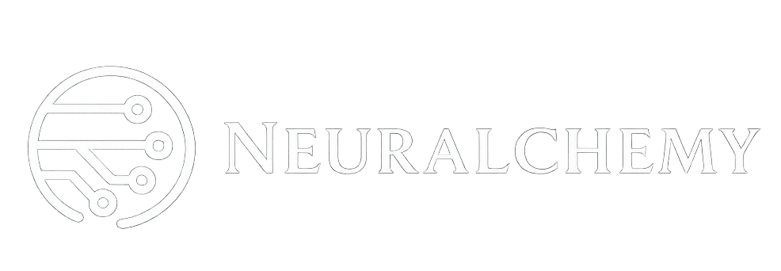

  

  Build secure, reliable, and long-term AI systems focused on safety, reasoning, and developer tooling.

---

## What We Build

Neuralchemy develops production-grade tools and frameworks for:

- AI security and robustness  
- Prompt injection research and defense  
- Reasoning and evaluation systems  
- Developer-first infrastructure  

Projects here are designed for stability, clarity, and long-term maintenance.

---

## Core Projects
### offensive security tools
- [PromptXploit](promptxploit) — study how language models can be manipulated and where weaknesses appear

### defensive security tools
- [PromptShield](promptshield) — protect AI apps from injection, misuse, and manipulation  

## Experimental Work
Early-stage ideas, fast prototypes, and research experiments live in a separate organization.
- Neuralchemy Labs — rapid experiments and vibecoding  

## Focus Areas

Neuralchemy works primarily in:

- AI safety and security  
- Prompt injection and defense  
- Reasoning systems  
- Evaluation frameworks  
- Developer tooling  
- Long-term maintainable software  

---

## Philosophy

- Build carefully  
- Think long-term  
- Design for failure  
- Ship what matters  

Neuralchemy is about creating tools that last, not chasing trends.
